# 动画分类

## 1.普通动画

一般添加动画有几种方式：

1. 增加属性来添加（Add Property）

   - 选择你需要生成动画改变的属性

      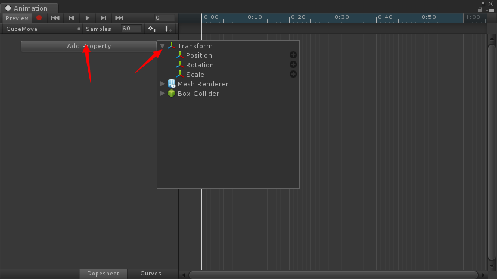

   - 比如选择了Position，会自动在0秒（第一帧）和第1秒（第60帧）生成当前一样属性的关键帧。

     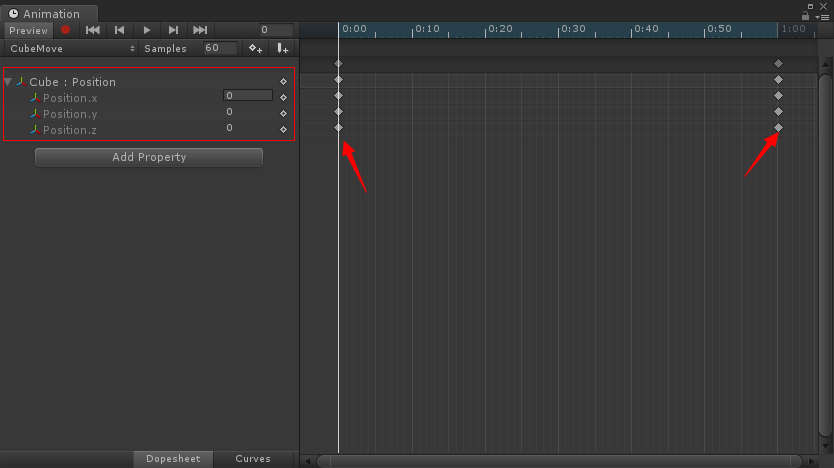

   - 将关键帧进度条拖到需要添加关键帧的位置，修改属性数值即可添加。

      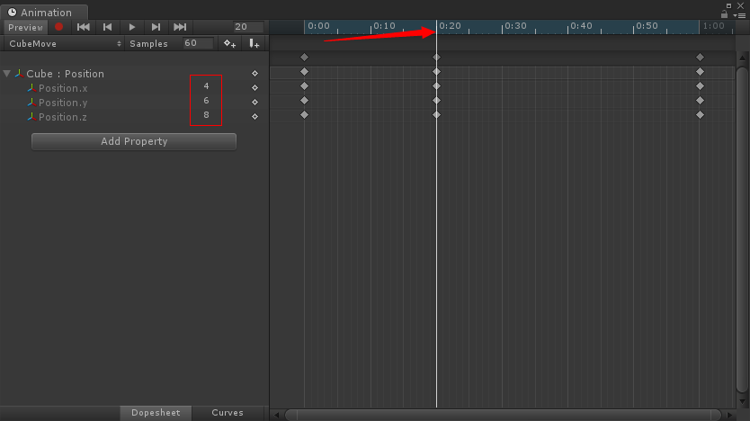

2. 右键添加关键帧

3. 录制添加关键帧

   点击录制时，拖动到需要添加关键帧的位置，然后再Inspector面板直接修改数据即可

   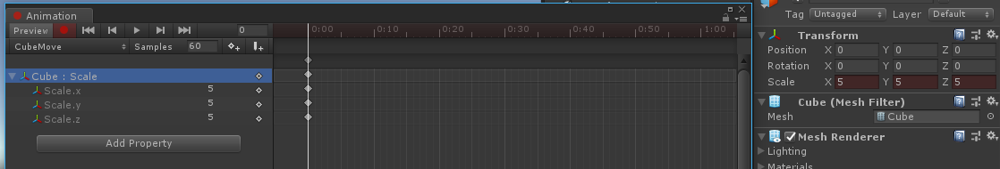

运行查看效果如图：

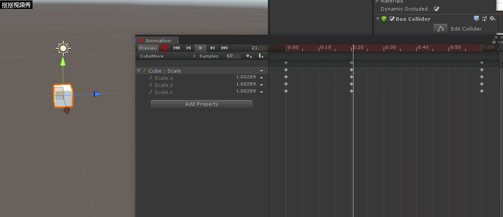

- 关于曲线编辑

  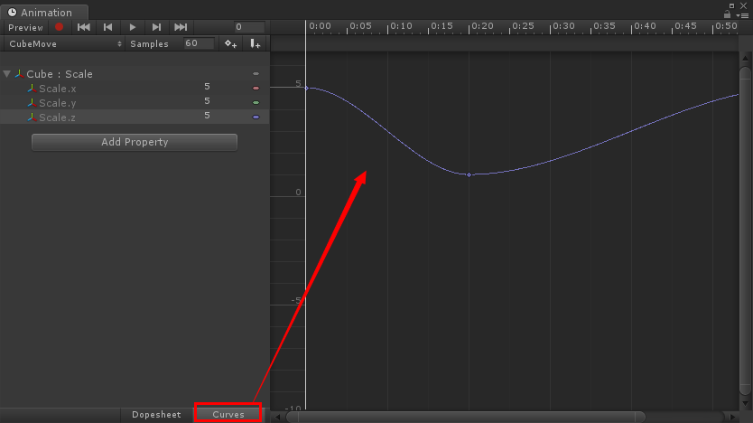

  - 点击Curves即可进行曲线编辑，可看到默认是按照平滑的曲线来进行的。

  - 每一条颜色的先代码左侧对应的属性（因为之前属性设置一样，所以三天线是重合的）。

  - 可以针对每个关键帧做曲线设置，比如：设置为直线，或者自定义拖拉为曲线，为了直观看到变化这里演示只改变Z轴位置。

    ​	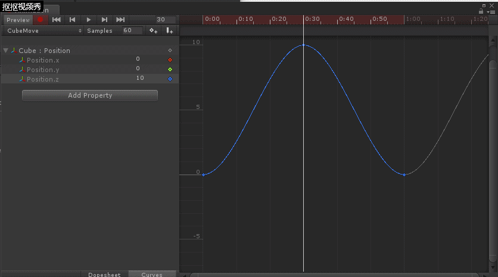

  - 可以看到运动轨迹先像Z轴正方向运行迅速移动，后快速向负方向移动然后稍微慢速的移到原点。

    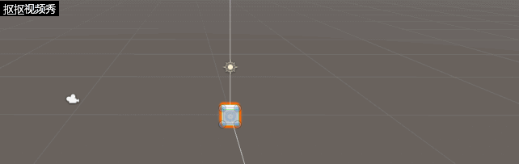

  

## 2.UGUI的按钮动画（四个状态）

- 添加一个Canvas，然后在里面添加一个Button，选择Button（Script）里面的Transition为Animation

  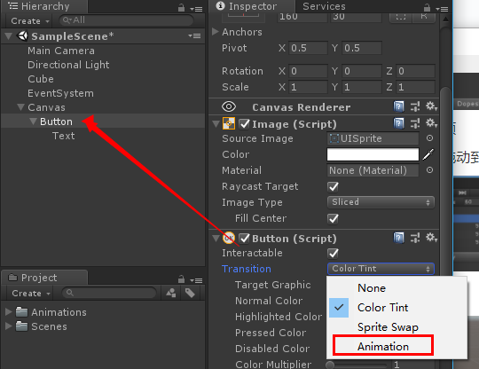

- 会出现四个状态，点击应用选择路径保存Animation

  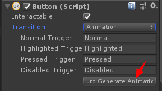

  - 四个状态分别为：正常、高亮（鼠标移动到按钮上没点击）、点击按钮、不可用状态

  - 打开动画模式窗口，会发现已有四个模式存在。

    ​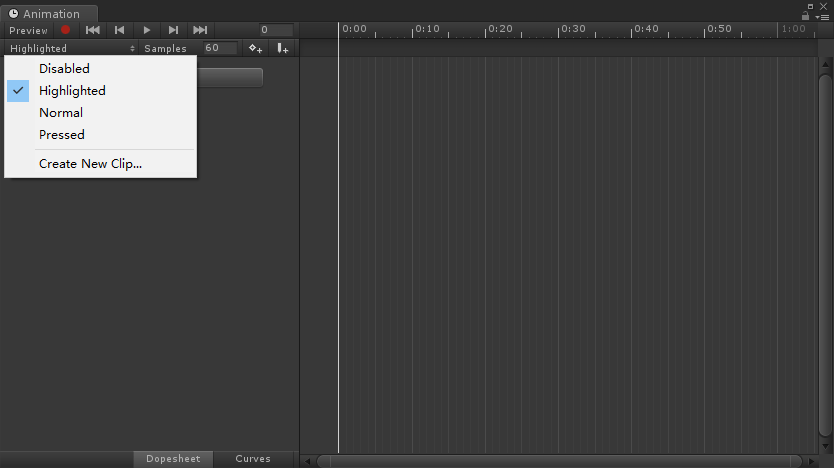
  
  - 进行和一种普通动画一样的编辑即可。