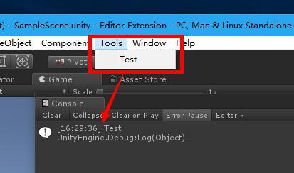
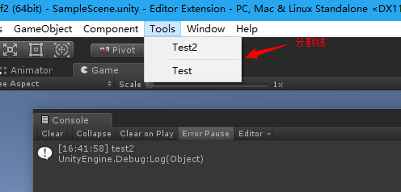
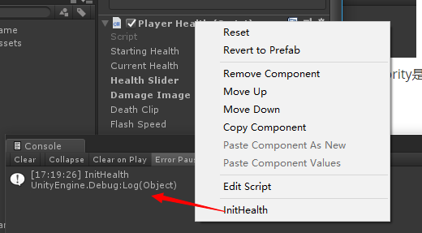
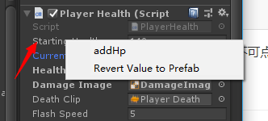
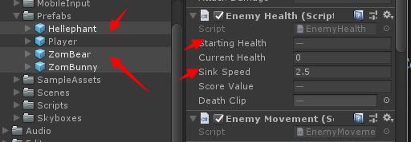
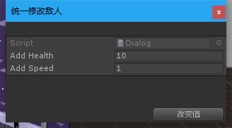
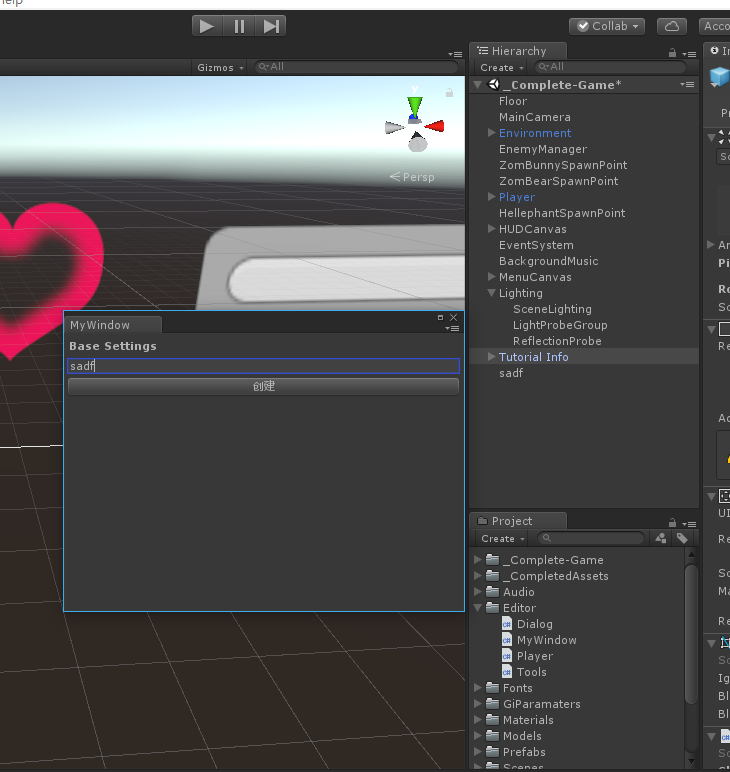

## 1.在Unity对应菜单栏添加一个菜单，点击调用对应的方法。

- ```c#
  [MenuItem("Tools/Test")]	// 区分大小写
  static void Test()
  {
      Debug.Log("Test");
  }
  ```

- 注意必须是静态方法，因为不需要实例调用

   	

  

- 菜单栏分类，菜单栏里面的priority相差大于10就是两个类别（会增加一个分割线）

- ```c#
  // 每个菜单栏的priority默认值为1000
  [MenuItem("Tools/Test2",false,priority =1)]
  static void Test2()
  {
      Debug.Log("test2");
  }
  ```

  ​	

- 会发现Test2跑上面去了，并且多了一个分割线。说明：从上到下的priority是从小到大

- 所以自定义添加的菜单可以根据优先级来分组。

## 2.组件添加右键菜单

- 格式必须是：CONTEXT/脚本名/菜单名

```c#
[MenuItem("CONTEXT/PlayerHealth/InitHealth")]
static void InitHealth(MenuCommand cmd)
{
    PlayerHealth health = cmd.context as PlayerHealth;  //获取对应的组件
    health.startingHealth = 200;    //设置组件对应的值
    Debug.Log("InitHealth");
}
```



## 3.添加菜单删除Gameobject

```c#
[MenuItem("Tools/MyDelete")]
static void MyDelete()
{
    foreach(GameObject o in Selection.objects)
    {
        // GameObject.DestroyImmediate(o); //脚本删除不能撤销
        Undo.DestroyObjectImmediate(o);     //注册的操作，删除了可以撤销
    }
}
```

## 4.菜单快捷键注册

- `[MenuItem("Tools/MyDelete _t")]`：T快捷键直接调用MyDelete
- 组合键：%=ctrl  #=shift  &=alt
- `[MenuItem("Tools/MyDelete %t")]`：Ctrl+T调用

## 5.验证菜单是否能点击

```c#
[MenuItem("Tools/MyDelete", true)]
static bool ValidMyDelete()
{
    if (Selection.objects.Length > 0)
        return true;
    return false;
}
```

- 针对（3）验证是否可以可以点击菜单删除。【如果没选择游戏对象，菜单变灰不可点击】

## 6.脚本添加右键菜单

- 在对应的的脚本里面比如PlayerHealth.cs里面添加

- ```c#
  [ContextMenu("InitHealth2")]
  void InitHealth2()
  {
      Debug.Log("InitHealth2");
  }
  ```

- 这是简单的一种方式，其实（2）中的方式也可以实现。

## 7.脚本属性添加右键菜单

- ```c#
  // 在对应属性前添加ContextMenuItem(属性名，方法名)
  [ContextMenuItem("addHp", "AddHP")]
  public int startingHealth = 100;
  
  void AddHP()
  {
      startingHealth += 20;
  }
  ```

- 

## 8.对话框操作

- ```c#
  using UnityEngine;
  using UnityEditor;
  
  public class Dialog : ScriptableWizard {
  
      public int addHealth = 10;
      public int addSpeed = 1;
  
      [MenuItem("Tools/CreateWizard")]
      static void CreateWizard()
      {
          // 标题  按钮名
          DisplayWizard<Dialog>("统一修改敌人","改变值");
      }
  
      // 检查对话框create按钮的点击，按钮名更改但是检查的函数名还是固定为OnWizardCreate
      private void OnWizardCreate()
      {
          GameObject[] gos = Selection.gameObjects;
          foreach(GameObject go in gos)
          {
              EnemyHealth hp = go.GetComponent<EnemyHealth>();
              //记录对象，可进行撤销操作，这句话一定要在改变值的前面，可撤销才能生效
              Undo.RecordObject(hp,"change health and speed");  
              hp.startingHealth += addHealth;
              hp.sinkSpeed += addSpeed;
          }
      }
  }
  
  ```

- 

- 

- 选中多个敌人Perfabs。

- Tools/CreateWizard菜单栏打开对话框。

- 点击改变值，会发现选择的几个对象相应的血量增加了10，速度增加了1。

- ctrl+z 可以撤销改变值操作。

## 9.提示信息

- `ShowNotification(new GUIContent("xxxxx"));`
- 注意里面必须会GUIContent类型。

## 10.保存自定义菜单临时数据

```c#
// 保存数据到本地，不会被打包。自己决定什么时候保存
private void SaveData()
{
    EditorPrefs.SetInt("xx", addHealth);
    EditorPrefs.SetInt("yy", addSpeed);
}

// 8中对话框打开时调用，加载数据
private void OnEnable()
{
    addHealth = EditorPrefs.GetInt("xx", addHealth);
    addSpeed = EditorPrefs.GetInt("yy", addSpeed);
}
```

## 11.自定义窗口

- ```c#
  using UnityEngine;
  using UnityEditor;
  
  public class MyWindow:EditorWindow
  {
  
      [MenuItem("Tools/MyWindow &R")]
      static void ShowMyWindow()
      {
          MyWindow window = EditorWindow.GetWindow<MyWindow>();
          window.Show();
      }
  
      private string myName = "";
      private void OnGUI()
      {
          GUILayout.Label("Base Settings", EditorStyles.boldLabel);
          myName = GUILayout.TextField(myName);
          if(myName.Length > 0 && GUILayout.Button("创建"))
          {
              GameObject go = new GameObject(myName);
              Undo.RegisterCreatedObjectUndo(go, "Create_" + myName);
              myName = "";
          }
      }
  }
  
  ```

- 绘制自定义窗口，包括：label提示、TextField输入框、Button按钮。

- 实现的是创建一个名为TextField输入的空Gameobject。

- 

  