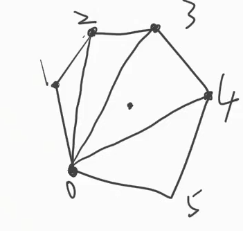

# Mesh几要素

- 定点
- 三角形
- UV
- normal（法线）
- Tangent（切线）

# 画一个Mesh步骤

1. 确定定点：Vector3[] 定点坐标，局部坐标；
2. 指定三角形，按顺序来的int[]；
3. 指定UV、法线、切线；

```c#
[RequireComponent(typeof(MeshFilter))]
[RequireComponent(typeof(MeshRenderer))]
public class TriangleDraw:MeshDrawBase
{
    public List<Vector3> vts = new List<Vector3>();
    
	private void Start()
    {
        mh = new Mesh();
        
        tris = new int[3];
        for(int i = 0; i < vts.Count; i++)
        {
            tris[i] = i;
        }
        // 获取顶点
        mh.vertices = vts.ToArray();
        // 三角形 顺时针画
        mh.triangles = tris;

        mh.RecalculateBounds(); // 重新计算边界
        mh.RecalculateNormals();// 重新计算法线
        mh.RecalculateTangents();// 重新计算切线

        targetFilter.mesh = mh;
    }
}
```

# 什么是UV

> UV：这里是指u,v纹理贴图坐标的简称(它和空间模型的X, Y, Z轴是类似的). 
>
> - 完整的说，其实应该是UVW，那W呢？贴图是二维的，W的方向垂直于显示器表面，一般用于程序贴图或者某些3D贴图技术（记住，确实有三维贴图这种概念！），对于游戏而言不常用到，所以一般我们就简称UV了。
>
> - 它定义了图片上每个点的位置的信息. 这些点与3D模型是相互联系的, 以决定表面纹理贴图的位置. UV就是将图像上每一个点精确对应到模型物体的表面. 在点与点之间的间隙位置由软件进行图像光滑插值处理. 这就是所谓的UV贴图. 
>
> - U和V分别是图片在显示器水平、垂直方向上的坐标，取值一般都是0~1，也 就是（水平方向的第U个像素/图片宽度，垂直方向的第V个像素/图片高度）

# 多边形画法：

1.  (n-2)
2. 