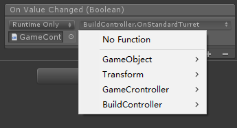
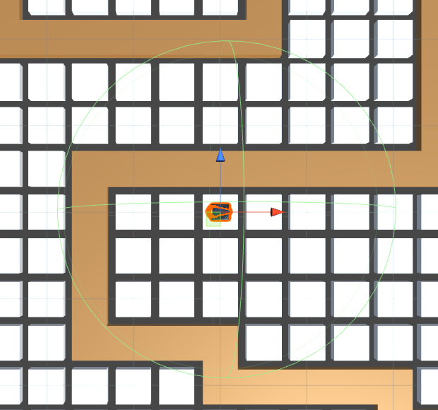
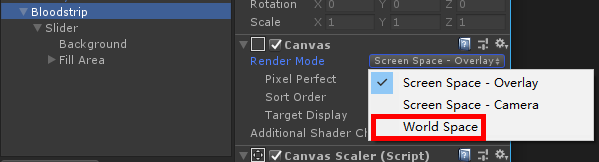
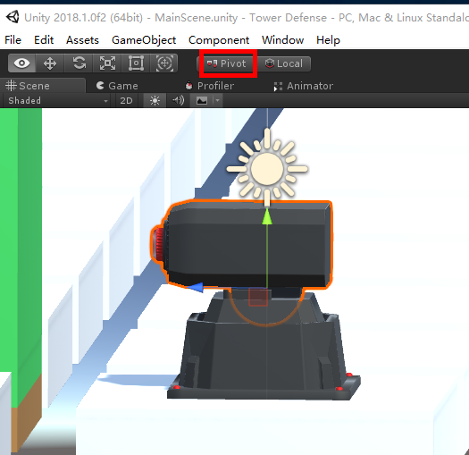
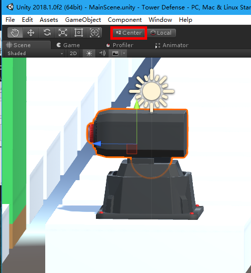
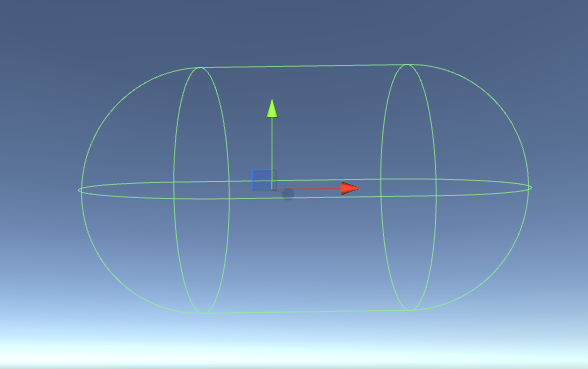

# 相机移动

```c#
float mouse = Input.GetAxis("Mouse ScrollWheel");	# 获取鼠标轮滑
transform.Translate(new Vector3(h * speed, mouse * mspeed, v * speed) * Time.deltaTime, Space.World);
# Space.World 相对世界坐标的移动
```

# 敌人生成

```c#
[System.Serializable]	//表面该类可序列化，可直接在Unity上显示操作

// 协成开始
void Start()
{
    StartCoroutine(EnemyGenerate());
}

// 协成生成敌人
IEnumerator EnemyGenerate()
{
    foreach (Wave wave in waves)
    {
        for (int i = 0; i < wave.count; i++)
        {
            GameObject.Instantiate(wave.enemy, MONSTER_START.position, Quaternion.identity);
            enemyCount++;
            if (i != wave.count - 1)
            {
                yield return new WaitForSeconds(wave.rate);
            }
        }
        while (enemyCount > 0)
            yield return 0;
        // 一波敌人结束后才生成另一波敌人
        yield return new WaitForSeconds(waveTime);
    }
}
```

# 创建炮塔

## 切换炮塔事件



- 点击Toggle Inspector里面对应的On Value Changed，绑定改变炮塔对应调用的函数

## 获取鼠标点击的游戏对象

```c#
// 返回一个从相机到屏幕点的光线
Ray ray = Camera.main.ScreenPointToRay(Input.mousePosition);
// debug
Debug.DrawRay(ray.origin, ray.direction * 10, Color.yellow);
RaycastHit hit; // 存放碰撞物体的信息
bool isCollider;

// ray:射线对象
// layerMask:选择那个层进行碰撞检测
// hit:存放碰撞物体的信息
// maxDistance:最远距离
isCollider = Physics.Raycast(ray, out hit, 1000, LayerMask.GetMask("MapCube"));
if (isCollider)
{
    // 得到点击的mapcube
    GameObject mapCube = hit.collider.gameObject;
}
```

## 地图方块控制

- `[HideInInspector]  // 不需要显示在面板 `


# 鼠标移动到cube上颜色变化



使用`OnMouseEnter`和`OnMouseExitOnMouseExit` 来进行判断鼠标是否进入cube

建造炮塔后当鼠标移动在炮塔攻击范围内时，发现并不会触发

因为在Edit/Projectsettings/Physics里面勾选了Queries Hit Triggers，首先和炮塔触发了，所以并没有和cube触发，取消勾选。

# 血条的显示

- 可以用UI/Slider来当做血条，设置前景背景色即可。
- 因为UI是二位的，而血条跟着敌人是基于世界空间来渲染的，所以需要修改RenderMode为世界空间
- 血条是跟着敌人的，所以直接拖到敌人身上成为子对象。

# 关于pivot center的一个问题

- pivot：模型坐标轴的真实位置。这个是开发中常用的模式 

- center：unity自己根据模型的mesh计算的中心位置，和模型真实坐标轴没关系了。 

- 当改变模型的坐标，角度，大小，指的是相对于pivot进行的操作 。

  Povot：

  

  Center：
  
  

可以看到坐标轴明显不在一个位置上 ，此时就容易犯错。

PS：尽量使用Pivot

# 添加Collider时注意

- 给物体添加Collider时，一定要注意坐标轴在哪里。

- 之前给一个空游戏对象添加Collider时，复制的其他对象的组件导致坐标轴偏移了很多，碰撞中用到坐标一直碰不到。

  

