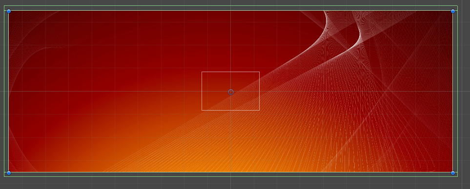
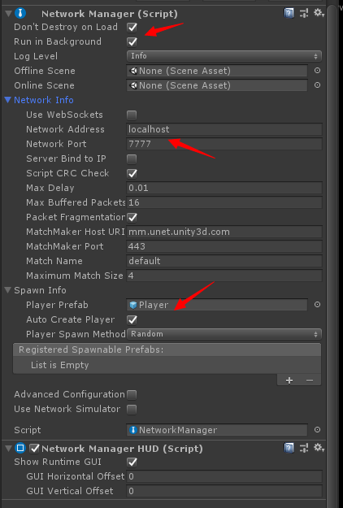
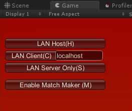
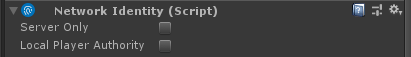
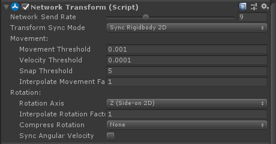
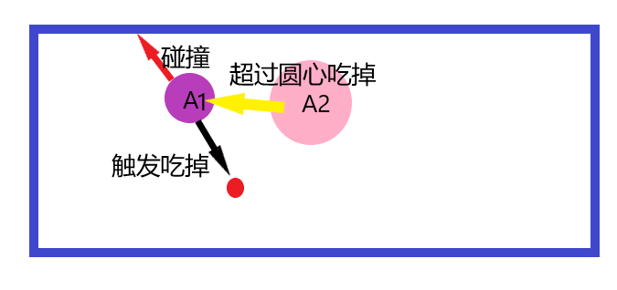
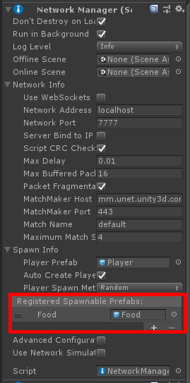
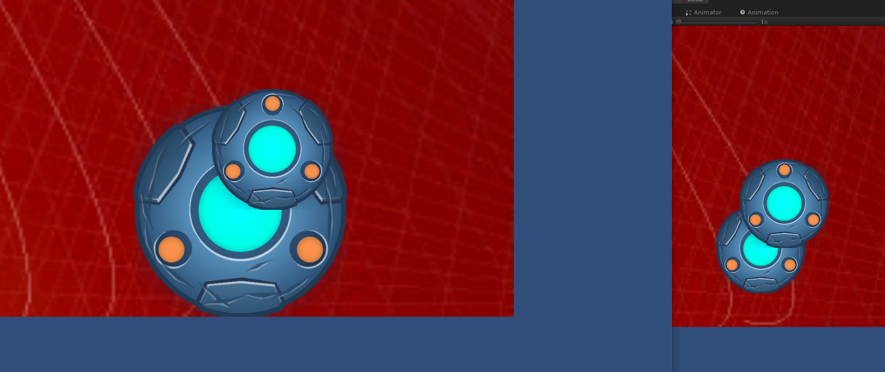

## 场景建立

1. 拖入背景图、添加四条边的collider、防止出界
2. 


## 添加网络管理：

- 这里涉及到两个unity的内置组件：Network Manager、Network Manager HUD
- Network Manager：管理游戏的网络状态。
  - 比如允许多端同步、服务器地址+端口等
  - 
- Network Manager HUD：管理游戏界面的网络状态。（同步游戏UI）
  - 设置水平、垂直的偏移量
  - 
  - LAN HOST：充当服务器+一个客户端。
  - LAN Client：仅作为客户端
  - LAN Server Only：仅作为服务器

## 制作Player预制体

- 根据自己喜爱制作一个玩家预制体。
- 在网络中分为两种player：
  - localplayer：本地玩家（你操控的对象）
  - remoteplayer：其他玩家
- 此时又需要引入一个新的组件：Network Identity（ 身份认证组件 ）
  - 
  - Server Only：仅受服务器控制
  - Local Player Authority：本地玩家控制。（所以需要勾选这个）


## 注册Player预制体

- 为什么要注册？
- 只有注册网络管理器才会使用预制体在场景生成新的游戏对象。
- 玩家连接服务器就知道使用那个预制体生成游戏玩家对象。


## 玩家移动

```c#
void FixedUpdate()
{
    float v = Input.GetAxis("Vertical");
    float h = Input.GetAxis("Horizontal");
    rb2d.AddForce(new Vector2(h, v) * speed * Time.deltaTime);
}
```

- 1.此时开多个客户端测试发现，操作本地玩家移动，发现其他角色也在做相同的移动。
- 2.本地玩家移动并没有同步到其他客户端。
- 原因：所有玩家都挂有上述脚本，所以在移动时都会GetAxis进行移动。

## NetworkBehaviour

- 网络的基础类，继承自 MonoBehaviour。
- isLocalPlayer： 当这个玩家物体属于本地客户端的物体时为true。
- 有多少个玩家，每个客户端就保存了多少个对象，只有本地的那个对象才有isLocalPlayer标记。

```c#
public class PlayerController:NetworkBehaviour
{
    void FixedUpdate()
    {
        if(!isLocalPlayer)
            return;
        float v = Input.GetAxis("Vertical");
        float h = Input.GetAxis("Horizontal");
        rb2d.AddForce(new Vector2(h, v) * speed * Time.deltaTime);
    }
}
```

- OnStartLocalPlayer：本地玩家初始化调用，所以这里可以做一些本地玩家的初始化逻辑。

## Network Transform组件

- 顾名思义，就是网络用来同步transfrom的组件，包括坐标、旋转、缩放。
- 
- Network Send Rate：同步发送的频率，X次/秒。


## 问题1

- 玩家和食物要求不碰撞（接触瞬间就吃掉）
- 玩家和玩家也不要求碰撞（包含别人的一半就吃掉别人）
- 玩家和周围墙壁碰撞（不能越界）
- 问改如何设置玩家A1、A2为碰撞器还是触发器？



## 解答：

- A添加两个collider，其中一个设为Trigger。

- 墙壁只添加碰撞器。（静态的所有不需要刚体）

- 食物只添加碰撞器。（一样是静态的）

- 在PhysicsSettings里面设置玩家和玩家不可碰撞。

```c#
         private void OnTriggerEnter2D(Collider2D collision)
     {
         if(!isLocalPlayer)
             return;
         if(collision.CompareTag("Food"))
         {
             // 吃掉食物
         }
     }
       
     private void OnTriggerStay2D(Collider2D collision)
     {
         if(!isLocalPlayer)
             return;
         if(collision.CompareTag("Player"))
         {
             // 判断是否覆盖对方圆心
         }
     }
```


## 客户端调用服务端执行

- 在继承制NetworkBehavior的类的函数上一行添加：[Command]

```c#
      [Command]   // 函数名需要Cmd前缀
      void CmdEatFood()
      {
          if(!isServer)
              return;
          //NetworkServer.Spawn(); // 同步对象到服务端
      }
```

## 服务端调用客户端里执行

```c#
      [ClientRpc] // 函数名需要Rpc前缀
      void RpcRespawn()
      {
          if(!isLocalPlayer)
              return;
      }
```

## 状态同步

```c#
    [SyncVar(hook = "OnChangeHealth")]
    public int health = 100;

    void OnChangeHealth(int curHealth)
    {
        
    }
```

- SyncVar ：代表需要在网络同步的属性；
  - hook：改变时调用的函数，将当前属性传入进去。


## 生成食物

1. 因为所有的食物都是一样的，在服务端生成，所以添加一个ServerGameObject；

2. 添加 Network Identity组件，设置为勾选Server Only；

3. 添加生成食物的脚本；

4. ```C#
   using System.Collections;
   using System.Collections.Generic;
   using UnityEngine;
   using UnityEngine.Networking;
   
   public class GenerateFoodManager:NetworkBehaviour
   {
   
       public GameObject food;
       public GameObject background;
       public int maxFood = 50;
   
       private int curFood = 0;
       private float boundaryWidth, boundaryHeight;
   
       public override void OnStartServer()
       {
           _InitBackBoundary();
           _InitFood();
       }
   
       private void _InitBackBoundary()
       {
           Vector3 mapSize = background.GetComponent<SpriteRenderer>().sprite.bounds.size;
           GlobalVar.Instance.MapX = mapSize.x;
           GlobalVar.Instance.MapY = mapSize.y;
   
           Vector3 foodSize = food.GetComponent<SpriteRenderer>().sprite.bounds.size; //求的是原来的大小，需要乘以倍数
   
           float foodWidth, foodHeight;
           foodWidth = foodSize.x * food.transform.localScale.x;
           foodHeight = foodSize.y * food.transform.localScale.y;
           boundaryWidth = (mapSize.x - foodWidth) / 2.0f;
           boundaryHeight = (mapSize.y - foodHeight) / 2.0f;
       }
   
       private void _InitFood()
       {
           while(curFood < maxFood)
               _GenerateFood();
       }
   
       Vector3 _RandomCoord()
       {
           float x = Random.Range(-boundaryWidth, boundaryWidth);
           float y = Random.Range(-boundaryHeight, boundaryHeight);
           return new Vector3(x, y, 0);
       }
   
       private void _GenerateFood()
       {
           if(curFood >= maxFood)
               return;
           GameObject go = GameObject.Instantiate(food, _RandomCoord(), Quaternion.identity);
           NetworkServer.Spawn(go);
           curFood += 1;
       }
   
   }
   
   ```

5. 制作Food的预制体，并将其添加到Network Manager里面的Registered Spawnable Prefabs

6. 

# 补充玩家吃掉食物逻辑

```c#
    private void OnTriggerEnter2D(Collider2D collision)
    {
        if(!isLocalPlayer)
            return;
        if(collision.CompareTag("Food"))
        {
            float r = collision.gameObject.GetComponent<FoodController>().Radius;
            GameObject oServerController = GameObject.Find("ServerController");
            oServerController.GetComponent<GenerateFoodManager>().CmdEatFood(collision.gameObject);
            _Becomebigger(r);
        }
    }
```

- 发现某些玩家吃食物时，运行GameObject.Find("ServerController")这一行报错，为空；

- 原因：ServerController这个对象只在服务端存在，所以需要调用[Command]客户端调用服务端逻辑这种方式：

- ```c#
      [Command]
      public void Cmd_EatFood(GameObject food)
      {
          if(!isServer)
              return;
          GameObject oServerController = GameObject.Find("ServerController");
          oServerController.GetComponent<GenerateFoodManager>().CmdEatFood(food);
      }
  ```


## 大小不同步



- 之前的判断都是在本地判断触发然后吃掉食物变大，所以只有本地玩家看到自己变大，其他端还是那么小。
- 第一想法：去掉本地碰撞，所有的各自都发生碰撞；
- 第二想法：本地碰撞，然后通知服务端，然后广播给其他客户端；
- 第三想法：直接在服务端进行碰撞，然后通知所有客户端；

## 玩家接触时没触发OnTriggerEnter2D

