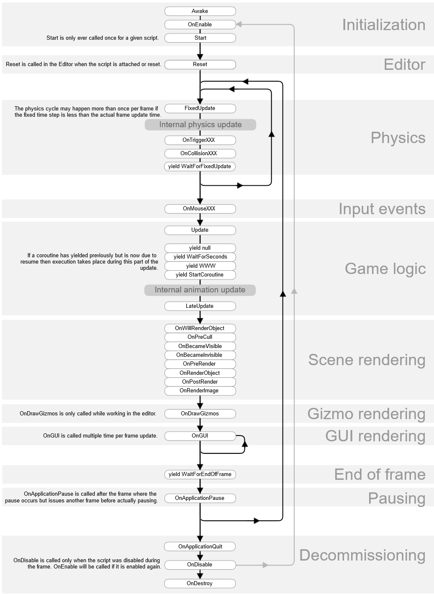
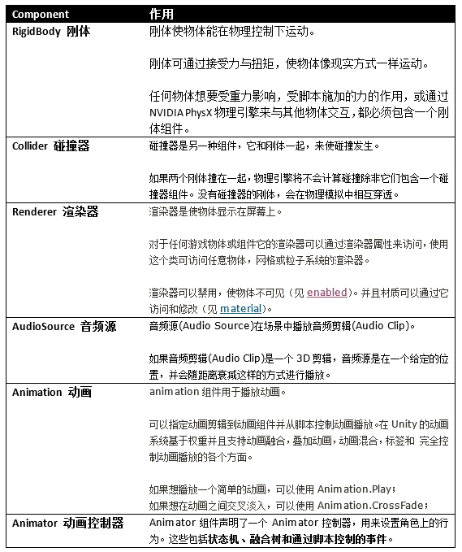
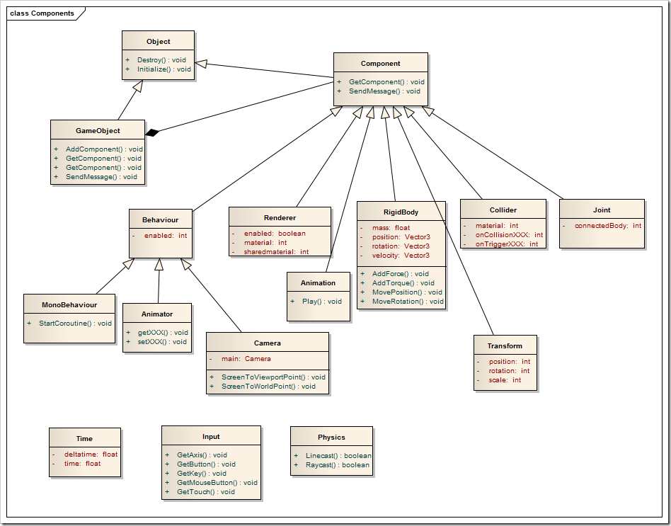

# 1.事件函数执行机制



# 2.Time类

- Time.deltaTime：每一帧的时间。
- Time.fixedDeltaTime：固定帧率执行的时间。
- Time.frameCount：运行帧的次数。
- Time.time：框架运行的时间（秒）。
- Time.realtimeSinceStartup：游戏开始后的实时时间。

# 3.创建游戏对象方法

1. `GameObject go = new GameObject("Cube");`
2. 根据prefab `GameObject.Instantiate(prefab);`
3. 创建原始的几何体`GameObject.CreatePrimitive(PrimitiveType.Plane);`

# 4.消息事件

```c#
// 参数解析：	方法名	- 参数 - 如果方法在目标对象上不存在，是否应该引发错误
// 在这个游戏对象或它的任何一个孩子的每一个 MonoBehaviour 中调用方法名
target.BroadcastMessage("Attack", null, SendMessageOptions.DontRequireReceiver);

//在这个游戏对象中的每一个 MonoBehaviour 上调用方法名
target.SendMessage("Attack", null, SendMessageOptions.DontRequireReceiver);

// 在这个游戏对象或它的所有父亲的每一个 MonoBehaviour 中调用方法名
target.SendMessageUpwards("Attack", null, SendMessageOptions.DontRequireReceiver);
```

# 5.Invoke

- 相当于定时调用函数

- ```c#
  Invoke("Attack",3);		//3秒后调用Attch方法
  InvokeRepeating("Attack", 4, 2);	//4秒后每隔2秒调用一次Attach
  CancelInvoke("Attack");		// 取消调用Attach定时器
  bool res = IsInvoking("Attack");	//判断Attach定时器是否还存在
  ```

# 6.Coroutine协成

- 启动结束协成的两种方式，必须要对应：

  ```c#
  private IEnumerator ie;
  ie = Fade();
  // 第一种
  StartCoroutine(ie);		// 启动
  StopCoroutine(ie);		// 关闭
  // 第二种
  StartCoroutine("Fade");	// 启动
  StopCoroutine("Fade");	// 关闭
  
  IEnumerator Fade()
  {
      while (true)
      {
          // do something
          yield return new WaitForSeconds(2);	// 返回值必须是yield这种形式
      }
  }
  ```

# 7.Mathf

```c#
//静态属性
Mathf.Deg2Rad;	//角度转弧度
Mathf.Rad2Deg;	//弧度转角度
Mathf.Infinity;	//正无穷的数
Mathf.NegativeInfinity；	//负无穷的数
Mathf.Epsilon;	//最小的浮点正数

// 静态方法
Mathf.Floor();	//向下取整，返回浮点数
Mathf.FloorToInt();	//向下取整，返回正整数
Mathf.ClosestPowerOfTwo(30);	//返回2^N最接近30的数，这里就是8.
Mathf.Clamp(Time.time, 1.0F, 3.0F)	//Time.time<1返回1，大于3返回3，中间返回自身
Mathf.Lerp(a, b, t）	//差值运算，返回 a+(b-a)*t 其中t=Mathf.Clamp(t,0,1)
Mathf.LerpUnclamped(a, b, t）	//差值运算，返回 a+(b-a)*t，t不做限制可以小于0，大于1
Mathf.MoveTowards(x, 10, Time.deltaTime*speed)	//从x变化到10，以每秒spped的速度
Mathf.PingPong(t, 20)	//返回的值将在0到20直接来回移动，比如0到20到0到20，t=19返回19 t=21返回19 t=40返回0
```

# 8.Input

```C#
// 鼠标按键
Input.GetMouseButton();		//鼠标按下触发
Input.GetMouseButtonDown();	//鼠标按下不动持续触发
Input.GetMouseButtonUp();	//鼠标松开触发

// 键盘按键，同理
Input.GetKey();
Input.GetKeyDown();
Input.GetKeyUp();

//Unity中设置的虚拟按键
Input.GetButton();
Input.GetButtonDown();
Input.GetButtonUp();

// 返回由axisName标识的虚拟轴的值
Input.GetAxis("Horizontal")	//平滑的获取水平方向按键的值 [-1, 1]： A D ← →
Input.GetAxisRaw("Horizontal")//平滑的获取水平方向按键的值- 1 0 1： A D ← →
// 同理垂直方向
Input.GetAxis("Vertical")	// W S ↑ ↓

    
// 静态属性，任何键（鼠标或者键盘）
Input.anyKeyDown;
Input.anyKey;

Input.mousePosition；	// 获取鼠标的相对于untiy的坐标，左下为(0,0)
```

# 9. Vector2/Vector3

```c#
Vector2 a = new Vector2(2, 2);
print(a.magnitude);		//返回向量长度
print(a.sqrMagnitude);	//返回向量平方长度
print(a.normalized);	// 返回单位化的向量
a.Normalize();			//自身单位化

Vector2.Angle(a, b);	//返回a和b直接的角度
Vector2.ClampMagnitude(c, 2);	//返回长度小于2的矢量向量
Vector2.Distance(b, c);		//两个点之前的距离

// 同Mathf
Vector2.Lerp(a, b, 0.5f)；
Vector2.LerpUnclamped(a, b, 0.5f)；
Vector2.MoveTowards(a, target, Time.deltaTime);

//向量是结构体，是值类型，要整体赋值
transform.position = new Vector3(3, 3, 3);
Vector3 pos = transform.position;
pos.x = 10;
transform.position = pos;
```

# 10.Radom

- `Random.InitState();`：随机种子，种子相同随机出来的数的顺序也相同
  -  (int)System.DateTime.Now.Ticks  想要不相同可以传入时间。
- Random.Range(4, 100)：随机返回[4, 99]中的一个整数
- Random.Range(4, 5f)：随机返回[4.0, 5.0]中的一个浮点数

# 11.Quaternion四元素

- 四元素是用来表示物体旋转的角度的。

- ```c#
  // 设置物体旋转的两种方式：
  cube.eulerAngles = new Vector3(45, 45, 45);
  cube.rotation = Quaternion.Euler(new Vector3(45, 45, 45));
  
  // 应用场景，玩家平滑旋转面向敌人
  Vector3 dir = enemy.position - player.position;
  dir.y = 0;	//取消在y轴（上下）方向的旋转
  Quaternion target= Quaternion.LookRotation(dir);
  player.rotation = Quaternion.Lerp(player.rotation, target, Time.deltaTime);
  ```

# 12.Camera相机

- 主要用途就是获取相机来进行射线检测（获取鼠标点击的对象）

- ```c#
  // 两种获取相机的方式
  mainCamera = GameObject.Find("MainCamera").GetComponent<Camera>();
  mainCamera = Camera.main;	// tag必须为MainCamera
  
  // 返回一个从相机到屏幕点的光线
  Ray ray = mainCamera.ScreenPointToRay (Input.mousePosition);
  
  // debug 画出射线
  Debug.DrawRay (ray.origin, ray.direction * 10, Color.yellow);
  
  // ray:射线对象
  // layerMask:选择那个层进行碰撞检测
  // hit:存放碰撞物体的信息
  // maxDistance:最远距离
  // 与那个层碰撞检测
  RaycastHit hit; // 存放碰撞物体的信息
  bool isCollider = Physics.Raycast (ray, out hit, 1000, LayerMask.GetMask ("MapCube"));
  // 得到对象
  MapCube mapCube = hit.collider.GetComponent<MapCube> ();
  ```

# 13.MonoBehaviour的生命周期

  

# 14.Unity基本组件



# 15.Unity3D重要模块的类图



# 16.Unity API图解合集

